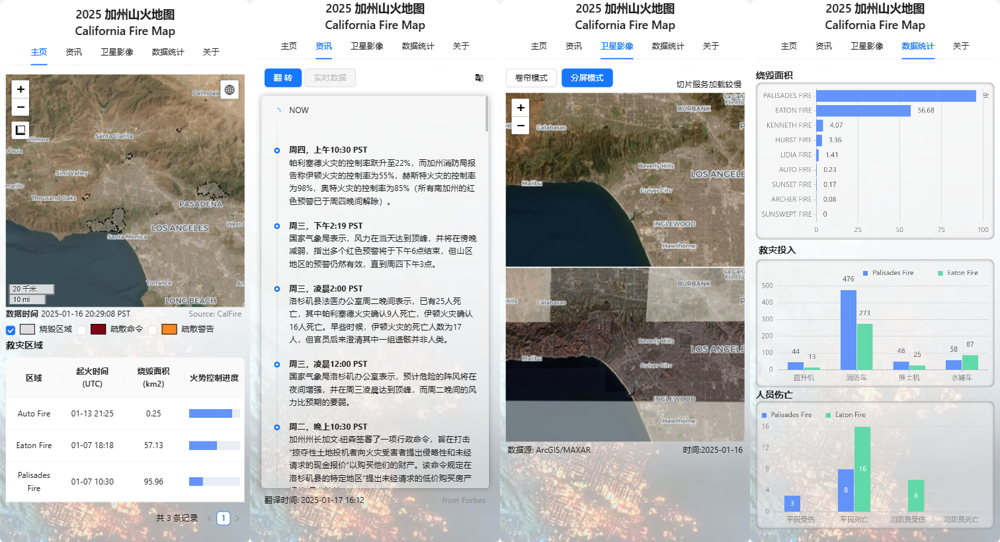

# california-fire-maps-dash

数据可视化练习项目，基于Python开发的Dash应用，用于记录个人健康信息。

rough demo on california fire maps apps powered by dash, python




## Dash组件
- feffery-antd-components
- feffery-antd-charts
- feffery-leaflet-components
- feffery_utils_components


## data source

[cbs-news](https://cbs-news-data.github.io/socal-fire-evacs_maplibre/)

[Southern California Fires January 2025 - arcgis online](https://calfire-forestry.maps.arcgis.com/home/item.html?id=0a7381c8b46b4e26a057383424f32c06)

https://www.fire.ca.gov

https://hub.wftiic.ca.gov

https://protect.genasys.com/hazards


## run

```cmd
pip install -i https://mirrors.tencent.com/pypi/simple -r requirements.txt && python app.py
```

